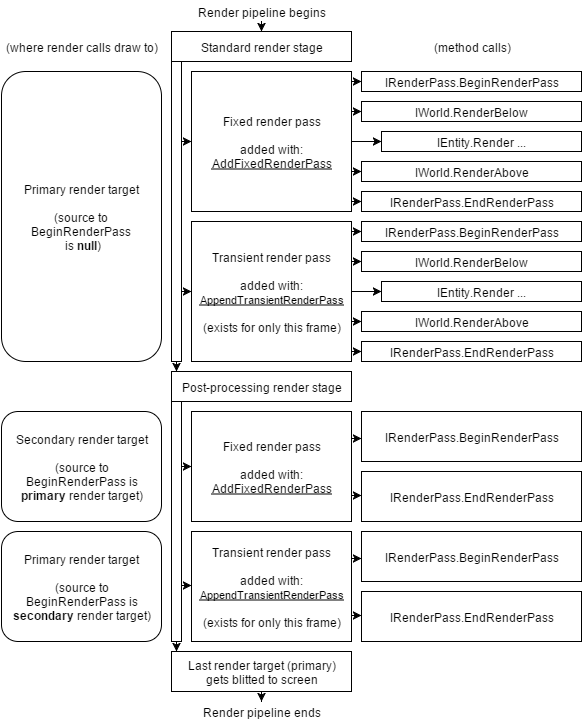

Render pipeline overview
===========================

Protogame uses a render pipeline to allow multiple render
passes to build the final result that is rendered to the
screen.  This allows post-processing effects to be easily
applied to your game.

The Protogame render pipeline is broken up into two stages;
the standard render stage and the post-processing render
stage.

Each render stage consists of fixed render passes and
transient render passes.

Fixed render passes are added to the pipeline during game startup 
:dotnet:method:`Protogame.CoreGame<TInitialWorld>.ConfigureRenderPipeline(IRenderPipeline,IKernel)`,
and added or removed from the pipeline at runtime with
:dotnet:method:`Protogame.IRenderPipeline.AddFixedRenderPass(IRenderPass)` and
:dotnet:method:`Protogame.IRenderPipeline.RemoveFixedRenderPass(IRenderPass)`
respectively.

Transient render passes are appended to the current frame of the
render pipeline with
:dotnet:method:`Protogame.IRenderPipeline.AppendTransientRenderPass(IRenderPass)`.
Transient render passes are only used for the current
frame, and do not occur on any future frames unless you call
:dotnet:method:`Protogame.IRenderPipeline.AppendTransientRenderPass(IRenderPass)`
again.

A visual graph of the render pipeline demonstrates the
method calls that are made during each stage, how render
pipelines are added, and what render targets are used
when rendering is performed in each pass:

Standard render stage
------------------------

During the standard render stage, all render passes are directed
at the same render target, and are applied in order.  

Types of standard render passes are:

  * :dotnet:type:`Protogame.I2DDirectRenderPass`
  * :dotnet:type:`Protogame.I2DBatchedRenderPass`
  * :dotnet:type:`Protogame.I3DRenderPass`
  
These render passes are used for general game rendering.  For example, you
can render your game in a :dotnet:type:`Protogame.I3DRenderPass`, and your
UI in a :dotnet:type:`Protogame.I2DDirectRenderPass` or
:dotnet:type:`Protogame.I2DBatchedRenderPass`.
  
Post-processing render stage
--------------------------------

During the post-processing render stage, each render pass is provided
a render target representing the result of the previous render stage.

Types of post-processing render passes are:

  * :dotnet:type:`Protogame.IInvertPostProcessingRenderPass`
  * :dotnet:type:`Protogame.IBlurPostProcessingRenderPass`
  * :dotnet:type:`Protogame.ICaptureCopyPostProcessingRenderPass`
  * :dotnet:type:`Protogame.ICaptureInlinePostProcessingRenderPass`
  * :dotnet:type:`Protogame.ICustomPostProcessingRenderPass`

These render passes are for applying additional effects after your game
has been rendered.

Creating render passes
--------------------------

Render passes can be created by injecting the :dotnet:type:`Protogame.IGraphicsFactory`
service, and using the methods available.