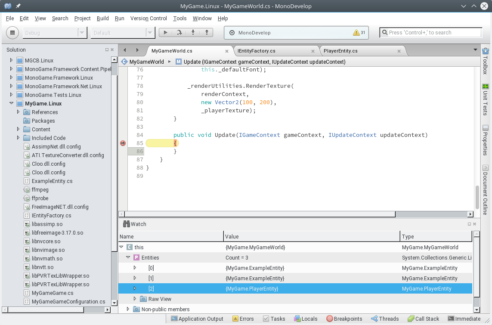
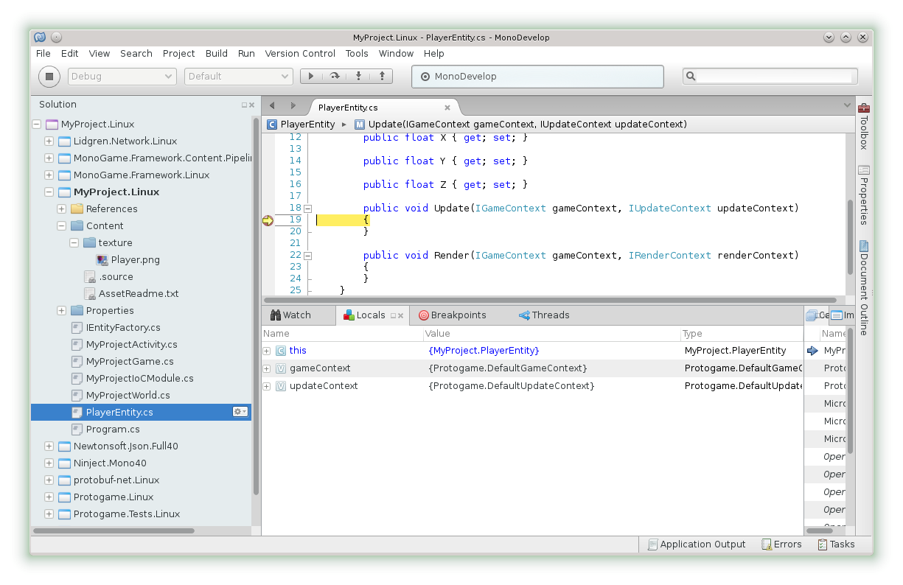
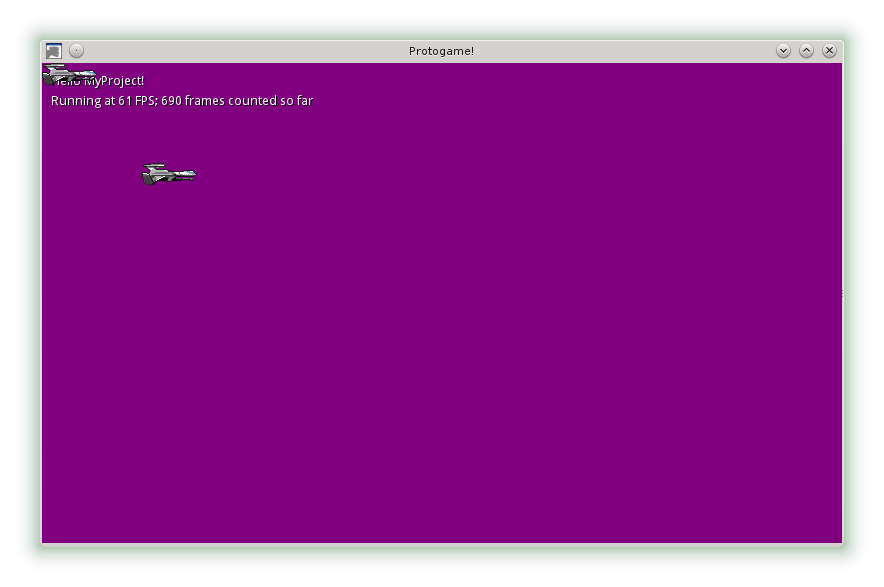

.. _walkthrough-add-a-player:

Add a player
======================================

.. danger::

  This walkthrough is seriously out-of-date.  It will be updated 
  in the near future.

.. warning::

  For this walkthrough, we are assuming you are following on
  from the :ref:`walkthrough-rendering-textures` walkthrough.

The rendering textures tutorial introduced rendering a player texture as
part of the world's render loop.  Obviously in a full game we can not be
placing rendering and update logic for every object in the world, so we
need some way of abstracting these concepts apart.

Entities are the concept that seperates individual instances of "things" in
the game world;  everything from players to enemies are encapsulated as
entities.

.. note::

  For more information about the exact sequence of
  Update and Render calls on entities, refer to the
  :ref:`updating-and-rendering` documentation.
  
Defining a new entity
-------------------------

Now we need to define a new player entity.  Entities are defined by
implementing the ``IEntity`` interface.  The most simplest entity that we can
define (that also does nothing), is:

.. literalinclude:: snippet/add_a_player_entity.cs
    :language: csharp

Add a new class to your project that matches this definition, such that the
entity is called `PlayerEntity`.

Add a factory method
----------------------

To create entities at runtime while still allowing them to be dependency injected,
you need to create a factory method.  The implementation of the factory is
automatically provided to you by Protogame; you just need to add the method
so that you have a way of instantiating the entity.

Modify the ``IEntityFactory`` interface in the project so that it has a method
to create a player entity:

.. literalinclude:: snippet/add_a_player_entity_factory_interface.cs
    :language: csharp
    :emphasize-lines: 10

Creating the player entity
----------------------------

Now that we have set up our interfaces, we can begin to create the entity
in our existing world.

Modify the constructor of the world to create an instance of ``PlayerEntity``
using the new ``CreatePlayerEntity`` method.

The world's constructor should now look similar to this:

.. literalinclude:: snippet/add_a_player_create_entity.cs
    :language: csharp
    :emphasize-lines: 30-31

Testing the player
--------------------------

If we now run the game and set a breakpoint in the IDE appropriately (as
indicated by the screenshot below), we will see the player entity in the
world's entity list:

If we place a breakpoint on the entity's Update method, we can see that
it is also hit as the game runs:

Rendering the player
-------------------------------

Now let's make our entity appear on screen.  To do so, we need to render a
texture as part of entity's Render call.

The process is very similar to what is described in :ref:`walkthrough-rendering-textures`.  If
you have not read that walkthrough, we highly recommend you do so.

In the same way that we rendered a texture in the world, we're going to
render a texture in the entity.  To recap, we needed to follow four steps:

  1. Inject the ``I2DRenderUtilities`` interface.  This provides the API to
     render the texture.
  2. Inject the ``IAssetManagerProvider`` interface.  From this we can gain
     access to the asset manager, and from there gain access to our
     texture asset.
  3. Gain a reference to the texture asset within the entity's constructor.
  4. Call the ``RenderTexture`` method against ``I2DRenderUtilities`` within
     the render loop.

Adjusting the render code
~~~~~~~~~~~~~~~~~~~~~~~~~~~~~~
     
This results in an entity definition that looks similar to the following:

.. literalinclude:: snippet/add_a_player_render_entity.cs
    :language: csharp

Viewing the result
~~~~~~~~~~~~~~~~~~~~~~
    
If you now run the game, you will see the following on your screen:

.. warning:: 
  
  The texture being rendered at position 100, 100 is due
  to the render texture call made in the world.  You will see this if you are
  following on directly from the rendering textures tutorial.  The texture in
  the top left of the screen is the texture being rendered by the player entity
  (due to it's X and Y position being initially 0, 0).
  
Updating the player
---------------------

Now that we have our player entity rendering, let's do something with it.  We
won't yet cover handling input from the player (that is discussed in :ref:`walkthrough-handling-input`),
but we will make it move around the screen on it's own.

We are going to make the following changes to our entity:

  - It will be initially positioned at 300, 300.
  - We will make it's X position the result of a sine wave, with an increasing
    counter as the input value.

Modify the entity's code so that Update loop matches the following code, and
that the specified field is defined:

.. literalinclude:: snippet/add_a_player_update_entity.cs
    :language: csharp

Viewing the animation
-----------------------

When running the game, you should get a result that looks similar to the
following video:

.. raw:: html

    <iframe width="600" height="360" src="//www.youtube.com/embed/Qyk-AlWWfcE" frameborder="0" allowfullscreen></iframe>
      
    
Next steps
----------------

We recommend continuing onto the next walkthough, :ref:`walkthrough-handling-input`.