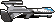
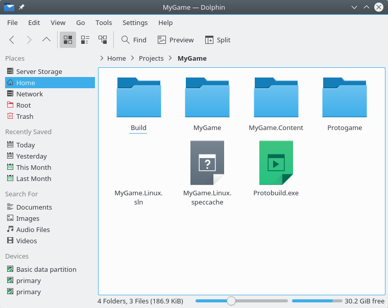
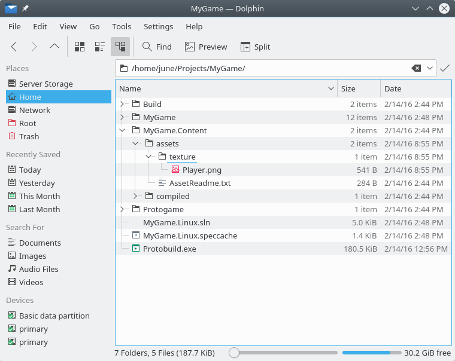
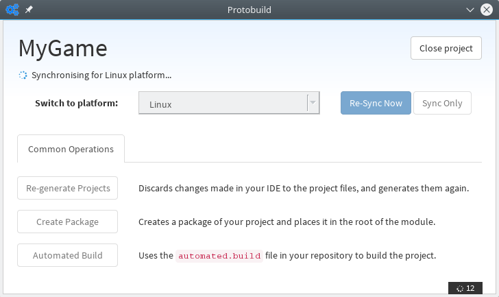
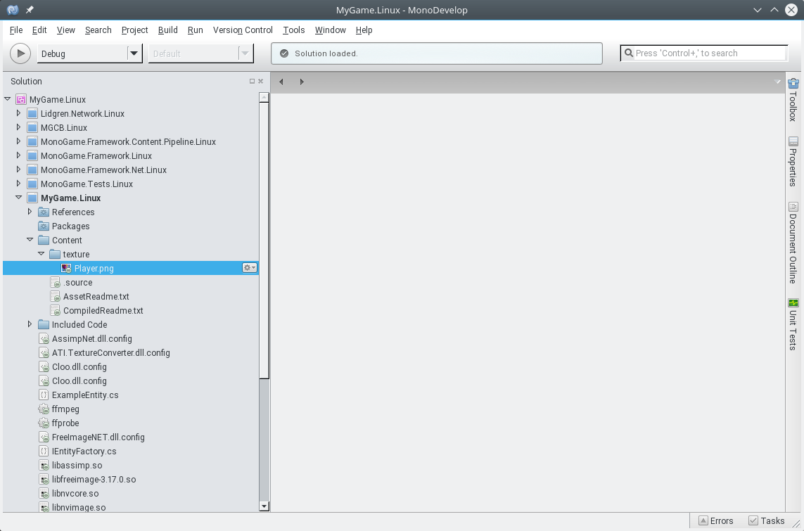
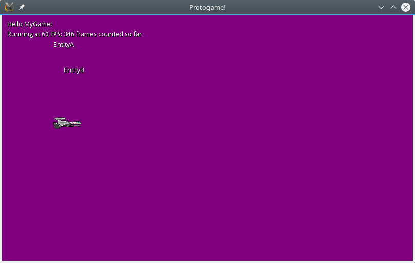

.. _walkthrough-rendering-textures:

Rendering textures
======================================

.. warning::

  For this walkthrough, we are assuming you are starting from the blank
  template.  If you haven't downloaded the blank template, please see
  :ref:`walkthrough-your-first-game` first.

The blank template starts you off with a very basic structure; just enough
to run a game on your development platform.

One of the most essential components of a game is the ability to render
graphics to the screen.  Although the blank template demonstrates rendering
text (using the built in font), it does not cover how to render a texture.

This tutorial will cover both importing a texture into the content directory,
and then rendering this texture as part of the world's "RenderAbove" logic.

For this tutorial, we'll be using the following image:

Right-click on the image above and save the image to your local computer.

This image is licensed CC0 / Public Domain from OpenGameArt.  It was sourced
from http://opengameart.org/content/stg-object-image.

Importing a texture
----------------------

Protogame uses content projects to reference and compile various different
types of assets, such as textures, audio, models and shaders.

The blank template will give you a project layout like the following:

In this structure, the ``MyProject`` folder is where your code is being stored;
for example the ``MyProjectWorld.cs`` file is located in here.

We need to add the texture file to the content project, which is stored
as the ``MyProject.Content`` project.

.. warning::

  Protogame content projects do not work in the same way as XNA content
  projects.  There is no explicit "content project file" with the `.contentproj`
  extension, as these types of projects do not work on any platform other
  Windows / XNA.

To import the texture, it is a simple case of placing the PNG file within the
content project folder.  It is general convention to organise assets by their
type; because are importing a texture, we create a ``texture`` folder and then
place our PNG file within it.

Once this is complete, you should end up with a structure like the following:

Due to the way content projects work in Protogame, you now need to resynchronise
the projects with the Protobuild Manager.  On this screen, press the "Re-sync Now"
button:

.. danger:: 
  
  You must resynchronise cross-platform projects at this point.  If you do
  not, the texture will not be copied to the output folder
  upon build, and you will not be able to load it.

After running Protobuild, the project should now show the texture within the
MyGame project:

Rendering a texture: Summary
-------------------------------

Now that we have imported our texture, we need to call the appropriate
Protogame APIs to render the texture.

Since we have not yet covered adding entities to the game, we will be
adding the render call to the world's render logic.

To be able to render textures in a game, we need to have four steps
completed:

  1. Inject the ``I2DRenderUtilities`` interface.  This provides the API to
     render the texture.
  2. Inject the ``IAssetManagerProvider`` interface.  From this we can gain
     access to the asset manager, and from there gain access to our
     texture asset.
  3. Gain a reference to the texture asset within the world's constructor.
  4. Call the ``RenderTexture`` method against ``I2DRenderUtilities`` within
     the render loop.

Luckily for us, the blank template already injects both the ``I2DRenderUtilities``
and ``IAssetManagerProvider`` interfaces, as it needs these interfaces to
perform text rendering.

However, we still need to gain a reference to the texture asset and store
it for later usage within the render loop.

Referencing an asset
------------------------

To reference an asset, we gain a reference to the asset manager and call
the `Get` method.  To gain access to our texture, add the following call
to the world's constructor:

.. literalinclude:: snippet/referencing_an_asset_constructor.cs
    :language: csharp

You will also need to add a field to the world implementation for storing
a reference to the player texture:

.. literalinclude:: snippet/referencing_an_asset_field.cs
    :language: csharp
    
Overall, the start of the world implementation should now look similar to
this:

.. literalinclude:: snippet/referencing_an_asset_full_code.cs
    :language: csharp
    :emphasize-lines: 17,43-46

Call the 2D Render Utilities API
----------------------------------

Inside the render loop, we now need to call the API to render the texture.  Add
the following call to the end of the `RenderBelow` method:

.. literalinclude:: snippet/2drenderutil_rendertexture.cs
    :language: csharp
    
This should result in the `RenderBelow` method looking similar to the following
code:

.. literalinclude:: snippet/2drenderutil_rendertexture_full_code.cs
    :language: csharp
    :emphasize-lines: 17-20

Viewing the result
--------------------

If you now build and run the game, you should see the following appear:

Next steps
----------------

We recommend continuing onto the next walkthough, :ref:`walkthrough-add-a-player`.