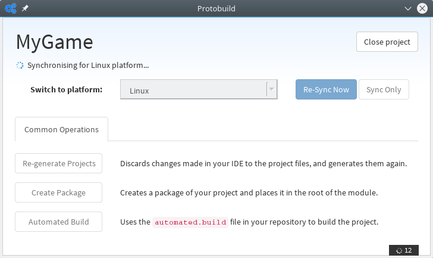

.. _walkthrough-your-first-game:

Creating your first game
======================================

Unlike other game engines, Protogame is not installed on your computer; instead it
is a library that you download for each project.  If you've ever used FlashPunk_,
you'll be used to this way of working.

.. _FlashPunk: http://useflashpunk.net/

Install an IDE
------------------

It's pretty safe to assume that you've already done this step, especially if you've been developing
in C# before.

You will need either Visual Studio, Xamarin Studio or MonoDevelop.  You can also use command-line build
tools such as msbuild or xbuild if you wish.

Visual Studio Community
~~~~~~~~~~~~~~~~~~~~~~~~

If you are developing on Windows, then Visual Studio Community is highly recommended.
You can download Visual Studio Community from the `Visual Studio`_ website.

    
.. _Visual Studio: https://www.visualstudio.com/

Xamarin Studio / MonoDevelop
~~~~~~~~~~~~~~~~~~~~~~~~~~~~~~~

If you are developing on Mac OS X or Linux, or you want to target mobile platforms through Xamarin, you'll
need to use Xamarin Studio or MonoDevelop.

Xamarin Studio for Windows or Mac OS X can be downloaded from the `Xamarin download site`_.

MonoDevelop for Linux can be downloaded through the package manager for your Linux distribution.

.. _Xamarin download site: http://xamarin.com/download

Install Protobuild
---------------------------

Protobuild is a cross-platform project manager for .NET.  It makes developing cross-platform
games in C# easy, by taking care of all of the platform-specific dependencies you need.

To install Protobuild, go the `Protobuild website`_ and install it for the operating
system you want to develop on.

.. _Protobuild website: http://protobuild.org/

.. raw:: html

    

      <strong>
        <a id="download" href="http://protobuild.org/" target="_blank">Download Protobuild</a>
      </strong>
    

    

After you have installed Protobuild, run the Protobuild Manager from your Start Menu (on Windows),
Spotlight (on Mac) or KDE/GNOME menu (on Linux).

Create your project
---------------------

Once you have the Protobuild Manager open, you should see the following start screen:

From here, click on "Create New Project" and select the Empty Project template:

Give your project a name, and click "Create Project".  Leave the project type as "Protobuild".

This will take a while Protogame is downloaded and all of the dependencies are fetched:

Once this finishes, either Visual Studio, Xamarin Studio or MonoDevelop will be automatically
launched to open your project.

.. note::

  In future you should open your project through the Protobuild Manager rather than your IDE.
  This will ensure that the cross-platform information about your project is saved correctly.

Running the game
-------------------

Once you have opened the solution file with your IDE, you can build and run the game.

Starting the debugger
~~~~~~~~~~~~~~~~~~~~~~~~~

Under Visual Studio, you can run the game with the "Debug" button on the toolbar:

.. image:: img/visualstudio-debug.png

Under Xamarin Studio or MonoDevelop, you can run the game with the large "Play" icon:

Verifying everything works
~~~~~~~~~~~~~~~~~~~~~~~~~~~~

If you have downloaded the blank template, you should now see something similar
to the following window when running the game:

Next steps
----------------

We recommend continuing onto the next walkthough, :ref:`walkthrough-rendering-textures`.

